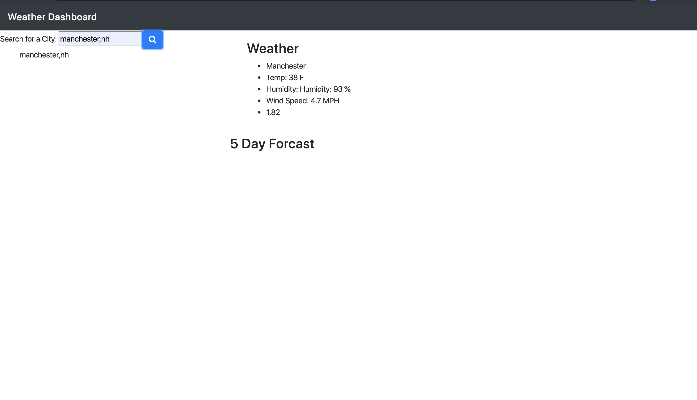

# Weather-Check
Assignment 6, weather dashboard. Made by Danielle Daley.

## Description
This application will give you the ability to check the weater wherever you want. It will give you the current weather as well as the five day forcast. Simply type where you want to see the weather for in the search bar and hit the button. The information will show on the screen as well as save in the local storage so when you refesh the page it will still be there. The application is hosted by GitHub.

## Links
[Github Repo](https://github.com/danielledaley2196/weather-check)
 
[Live Application](https://danielledaley2196.github.io/weather-check/)

## Screenshots
